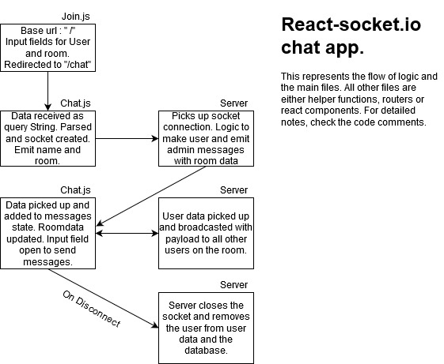

## This repository is an example of a chat room created using socket.io with a Node.js(Express) Back end and React front end. 

### Follow the logic flowchart and the component files' comments to understand the working behind all the code.

Test it out here : http://tiny.cc/d91woz
